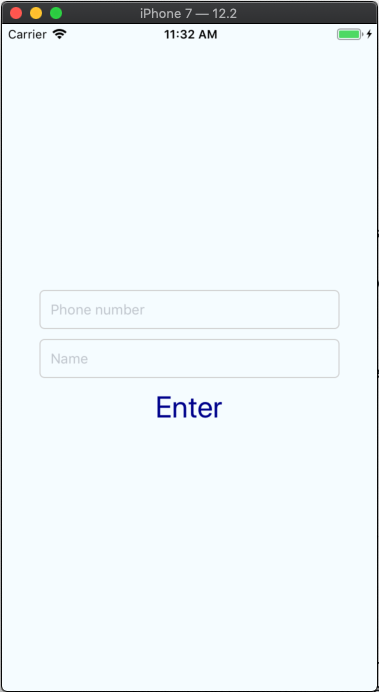
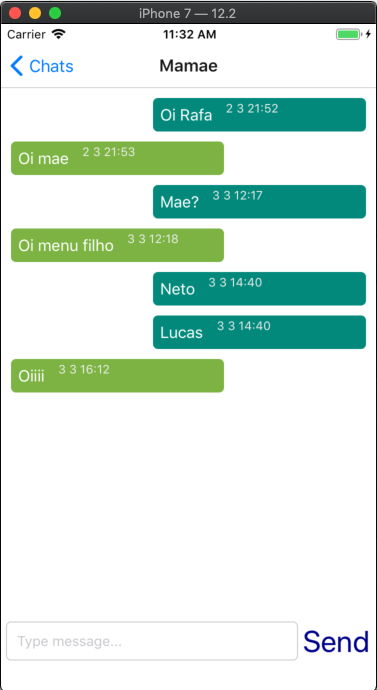
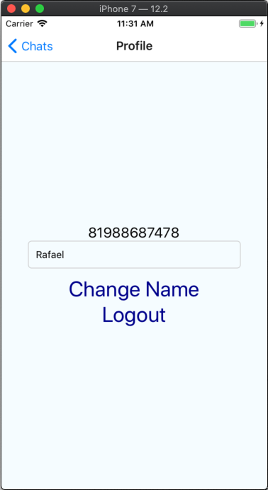

# Firebasechat
## Tools
> ( React Native + Firebase Realtime Database + Firebase Auth ) <br>

## Description
* Chat application in real time, with visualization of other users, profile and chat room. <br>

## Target
* App created in react native with the aim of practicing the knowledge of javascript, react native and firebase <br>

## Screens
### Login Screen
 <br>
### Chats Screen
 <br>
### Chat Screen
 <br>
### Profile Screen
 <br>

## How to run
* MacOs: In terminal executes the following code:
```
$ react-native run-ios --simulator='iPhone 7'
```

## Contact
* Rafael.dougllas@gmail.com


